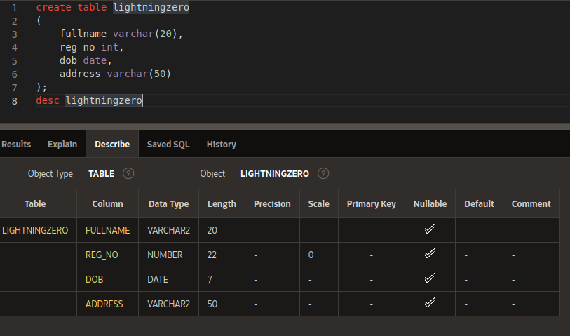
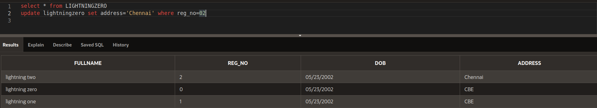

# SQL NOTES

## TOPIC'S AND SOLUTION 💛
<hr>

## create table and descending
  **Syntax**
```
create table <table_name>
(
  Column_name varchar(10),  /* varchar for number of input into the box */
  Column_name int,          /* int for only numbers into the box */
  Column_name date,         /* date 'mm-dd-yyyy' */
  Column_name varchar(50),  
);
desc <table_name> /* DESC command is used to sort the data returned in descending order */
```
  **Example**
```
create table lightningzero
(
  full_name varchar(10),
  reg_no int,
  dob date,
  address varchar(50)
);
desc lightningzero
```
  **Output**
  <br>


## insert values into the table 
  **Syntax**
```
insert into <table_name> values (<Column_1_value>,<Column_2_value>,<Column_3_value>,<Column_4_value>,...);
```
  **Example**
```
insert into lightningzero values ('lightning zero',00,'05-23-2002','CBE');
```
  **Output**
  <br>


## updating values for single values in column
  **Syntax**
```
update <table_name> set <Column_1_value>='<value1>' where <Column_2_value>='<specific_value_for_this_user>';
```
  **Example**
```
update lightningzero set address='Chennai' where reg_no=02;
```
  **Output**
  <br>


## updating values for a column
  **Syntax**
```
update <table_name> set <Column_1_value>='<value1>';
```
  **Example**
```
update lightningzero set blood_group='B+';
```
